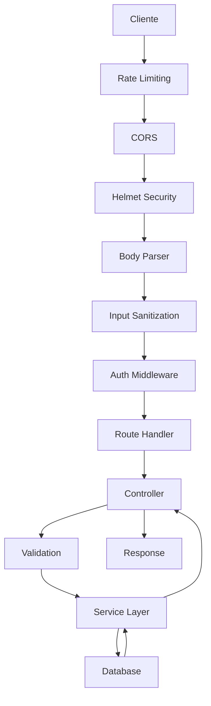

# 📚 Documentación Técnica del Backend

## 🏗️ Arquitectura del Sistema

### Patrón de Diseño
El backend implementa una arquitectura por capas (Layered Architecture) con separación clara de responsabilidades:

```
┌─────────────────┐
│   Routes        │ ← Definición de endpoints y middlewares
├─────────────────┤
│   Controllers   │ ← Lógica de presentación y validación HTTP
├─────────────────┤
│   Services      │ ← Lógica de negocio y reglas de dominio
├─────────────────┤
│   Data Access   │ ← Acceso a base de datos (MySQL)
└─────────────────┘
```

### Flujo de Requests


## 🔐 Sistema de Autenticación

### JWT Implementation
```javascript
// Token Structure
{
  "header": {
    "alg": "HS256",
    "typ": "JWT"
  },
  "payload": {
    "id": 1,
    "correo": "user@example.com",
    "rol": 2,
    "iat": 1642684800,
    "exp": 1642713600
  }
}
```

### Roles y Permisos
```javascript
const ROLES = {
  USUARIO: 1,        // Usuario básico
  ADMINISTRADOR: 2,  // Acceso total
  COORDINADOR: 3     // Acceso limitado por subalmacén
};

// Middleware de autorización
const requireRole = (requiredRole) => {
  return (req, res, next) => {
    if (req.usuario.rol < requiredRole) {
      return res.status(403).json({ error: 'Permisos insuficientes' });
    }
    next();
  };
};
```

## 🛡️ Seguridad Implementada

### 1. Rate Limiting
```javascript
// Configuración por endpoint
const loginLimiter = rateLimit({
  windowMs: 15 * 60 * 1000, // 15 minutos
  max: 5, // 5 intentos por IP
  message: 'Demasiados intentos de login',
  standardHeaders: true,
  legacyHeaders: false
});

const apiLimiter = rateLimit({
  windowMs: 15 * 60 * 1000, // 15 minutos
  max: 100, // 100 requests por IP
  message: 'Demasiadas requests, intenta más tarde'
});
```

### 2. Input Validation
```javascript
// Ejemplo de validación con express-validator
export const validarLogin = [
  body('correo')
    .isEmail()
    .withMessage('Formato de correo inválido')
    .normalizeEmail(),
  
  body('contraseña')
    .isLength({ min: 8, max: 128 })
    .withMessage('Contraseña debe tener entre 8 y 128 caracteres')
    .matches(/^(?=.*[a-z])(?=.*[A-Z])(?=.*\d)(?=.*[@$!%*?&])/)
    .withMessage('Contraseña debe contener mayúscula, minúscula, número y carácter especial'),
  
  manejarErroresValidacion
];
```

### 3. SQL Injection Prevention
```javascript
// ✅ CORRECTO - Prepared Statements
const obtenerUsuario = async (id) => {
  const [rows] = await pool.query('SELECT * FROM usuarios WHERE id = ?', [id]);
  return rows[0];
};

// ❌ INCORRECTO - String concatenation (vulnerable)
const obtenerUsuarioMal = async (id) => {
  const query = `SELECT * FROM usuarios WHERE id = ${id}`;
  const [rows] = await pool.query(query);
  return rows[0];
};
```

### 4. Password Security
```javascript
import bcrypt from 'bcrypt';

// Encriptar contraseña
export const encriptarPassword = async (password) => {
  const saltRounds = 12; // Alto nivel de seguridad
  return await bcrypt.hash(password, saltRounds);
};

// Verificar contraseña
export const compararPassword = async (password, hashedPassword) => {
  return await bcrypt.compare(password, hashedPassword);
};
```

## 📊 Base de Datos

### Esquema Principal
```sql
-- Usuarios del sistema
CREATE TABLE usuarios (
  id INT PRIMARY KEY AUTO_INCREMENT,
  nombre VARCHAR(100) NOT NULL,
  correo VARCHAR(255) UNIQUE NOT NULL,
  password VARCHAR(255) NOT NULL, -- bcrypt hash
  rol_id INT NOT NULL,
  activo BOOLEAN DEFAULT TRUE,
  ya_ingreso BOOLEAN DEFAULT FALSE,
  created_at TIMESTAMP DEFAULT CURRENT_TIMESTAMP,
  updated_at TIMESTAMP DEFAULT CURRENT_TIMESTAMP ON UPDATE CURRENT_TIMESTAMP,
  INDEX idx_correo (correo),
  INDEX idx_rol (rol_id)
);

-- Trabajadores
CREATE TABLE trabajadores (
  id INT PRIMARY KEY AUTO_INCREMENT,
  nombre VARCHAR(100) NOT NULL,
  dni VARCHAR(8) UNIQUE NOT NULL,
  subalmacen_id INT NOT NULL,
  coordinador_id INT,
  horas_objetivo INT DEFAULT 0,
  activo BOOLEAN DEFAULT TRUE,
  created_at TIMESTAMP DEFAULT CURRENT_TIMESTAMP,
  INDEX idx_dni (dni),
  INDEX idx_subalmacen (subalmacen_id),
  INDEX idx_coordinador (coordinador_id)
);

-- Asistencias
CREATE TABLE asistencias (
  id INT PRIMARY KEY AUTO_INCREMENT,
  trabajador_id INT NOT NULL,
  subalmacen_id INT NOT NULL,
  hora_entrada TIME,
  hora_salida TIME,
  justificacion TEXT,
  registrado_por INT NOT NULL,
  programacion_fecha_id INT NOT NULL,
  created_at TIMESTAMP DEFAULT CURRENT_TIMESTAMP,
  updated_at TIMESTAMP DEFAULT CURRENT_TIMESTAMP ON UPDATE CURRENT_TIMESTAMP,
  INDEX idx_trabajador_fecha (trabajador_id, programacion_fecha_id),
  INDEX idx_subalmacen_fecha (subalmacen_id, programacion_fecha_id),
  INDEX idx_registrado_por (registrado_por),
  UNIQUE KEY unique_asistencia (trabajador_id, programacion_fecha_id)
);
```

### Optimizaciones de Performance
```sql
-- Índices para consultas frecuentes
CREATE INDEX idx_asistencias_fecha_subalmacen ON asistencias(programacion_fecha_id, subalmacen_id);
CREATE INDEX idx_trabajadores_activos ON trabajadores(activo, subalmacen_id);
CREATE INDEX idx_usuarios_activos ON usuarios(activo, rol_id);

-- Índice compuesto para dashboard
CREATE INDEX idx_asistencias_dashboard ON asistencias(subalmacen_id, programacion_fecha_id, hora_entrada, hora_salida);
```

## 🚀 Performance y Optimización

### Connection Pooling
```javascript
// config/db.js
import mysql from 'mysql2/promise';

const pool = mysql.createPool({
  host: process.env.DB_HOST,
  port: process.env.DB_PORT,
  user: process.env.DB_USER,
  password: process.env.DB_PASSWORD,
  database: process.env.DB_NAME,
  waitForConnections: true,
  connectionLimit: 10,      // Máximo 10 conexiones simultáneas
  queueLimit: 0,           // Sin límite en cola
  acquireTimeout: 60000,   // Timeout de 60 segundos
  timeout: 60000,          // Query timeout de 60 segundos
  reconnect: true,         // Reconectar automáticamente
  timezone: '+00:00'       // UTC timezone
});
```

### Bulk Operations
```javascript
// Inserción masiva optimizada
export const crearMultiplesAsistencias = async (asistenciasData) => {
  const values = asistenciasData.map(datos => [
    datos.trabajador_id,
    datos.subalmacen_id,
    datos.hora_entrada || null,
    datos.hora_salida || null,
    datos.justificacion || null,
    datos.registrado_por,
    datos.programacion_fecha_id
  ]);

  const placeholders = asistenciasData.map(() => '(?, ?, ?, ?, ?, ?, ?)').join(', ');
  const flatValues = values.flat();

  const [result] = await pool.query(
    `INSERT INTO asistencias (trabajador_id, subalmacen_id, hora_entrada, 
     hora_salida, justificacion, registrado_por, programacion_fecha_id) 
     VALUES ${placeholders}`,
    flatValues
  );

  return result;
};
```

### Caching Strategy
```javascript
// Simple in-memory cache para consultas frecuentes
class SimpleCache {
  constructor(ttl = 300000) { // 5 minutos por defecto
    this.cache = new Map();
    this.ttl = ttl;
  }

  set(key, value) {
    this.cache.set(key, {
      value,
      expires: Date.now() + this.ttl
    });
  }

  get(key) {
    const item = this.cache.get(key);
    if (!item) return null;
    
    if (Date.now() > item.expires) {
      this.cache.delete(key);
      return null;
    }
    
    return item.value;
  }
}

const rolesCache = new SimpleCache(600000); // 10 minutos para roles
```

## 📈 Monitoreo y Logging

### Structured Logging
```javascript
// utils/logger.js
const logger = {
  info: (message, meta = {}) => {
    const timestamp = new Date().toISOString();
    console.log(JSON.stringify({
      level: 'INFO',
      timestamp,
      message,
      ...meta
    }));
  },

  error: (message, error = null, meta = {}) => {
    const timestamp = new Date().toISOString();
    console.error(JSON.stringify({
      level: 'ERROR',
      timestamp,
      message,
      error: error?.message,
      stack: error?.stack,
      ...meta
    }));
  },

  performance: (operation, duration, meta = {}) => {
    const timestamp = new Date().toISOString();
    const level = duration > 1000 ? 'WARN' : 'INFO';
    console.log(JSON.stringify({
      level,
      timestamp,
      type: 'PERFORMANCE',
      operation,
      duration_ms: duration,
      ...meta
    }));
  }
};
```

### Health Checks
```javascript
// routes/health.js
export const healthCheck = async (req, res) => {
  const startTime = Date.now();
  
  try {
    // Verificar conexión a BD
    const [dbResult] = await pool.query('SELECT 1 as test');
    const dbLatency = Date.now() - startTime;
    
    // Verificar memoria
    const memoryUsage = process.memoryUsage();
    const memoryMB = {
      rss: Math.round(memoryUsage.rss / 1024 / 1024),
      heapTotal: Math.round(memoryUsage.heapTotal / 1024 / 1024),
      heapUsed: Math.round(memoryUsage.heapUsed / 1024 / 1024)
    };
    
    res.json({
      status: 'healthy',
      timestamp: new Date().toISOString(),
      uptime: process.uptime(),
      database: {
        status: 'connected',
        latency_ms: dbLatency
      },
      memory: memoryMB,
      node_version: process.version
    });
  } catch (error) {
    res.status(503).json({
      status: 'unhealthy',
      error: error.message,
      timestamp: new Date().toISOString()
    });
  }
};
```

## 🧪 Testing Guidelines

### Unit Testing Structure
```javascript
// tests/services/usuario.service.test.js
import { describe, it, expect, beforeEach, afterEach } from 'jest';
import { crearUsuario, obtenerUsuario } from '../src/services/usuario.service.js';

describe('Usuario Service', () => {
  beforeEach(async () => {
    // Setup test database
    await setupTestDB();
  });

  afterEach(async () => {
    // Cleanup test data
    await cleanupTestDB();
  });

  describe('crearUsuario', () => {
    it('should create user with encrypted password', async () => {
      const userData = {
        nombre: 'Test User',
        correo: 'test@example.com',
        password: 'Password123!',
        rol_id: 1
      };

      const result = await crearUsuario(userData);
      
      expect(result).toHaveProperty('id');
      expect(result.correo).toBe(userData.correo);
      expect(result.password).not.toBe(userData.password); // Should be encrypted
    });

    it('should reject duplicate email', async () => {
      const userData = {
        nombre: 'Test User',
        correo: 'existing@example.com',
        password: 'Password123!',
        rol_id: 1
      };

      await crearUsuario(userData); // First creation

      await expect(crearUsuario(userData))
        .rejects
        .toThrow('Email already exists');
    });
  });
});
```

### Integration Testing
```javascript
// tests/integration/auth.test.js
import request from 'supertest';
import app from '../src/index.js';

describe('Auth Integration Tests', () => {
  describe('POST /api/auth/login', () => {
    it('should authenticate valid user', async () => {
      const response = await request(app)
        .post('/api/auth/login')
        .send({
          correo: 'admin@brayamsac.com',
          contraseña: 'validPassword123!'
        })
        .expect(200);

      expect(response.body).toHaveProperty('token');
      expect(response.body).toHaveProperty('usuario');
      expect(response.body.usuario).toHaveProperty('id');
    });

    it('should reject invalid credentials', async () => {
      await request(app)
        .post('/api/auth/login')
        .send({
          correo: 'admin@brayamsac.com',
          contraseña: 'wrongPassword'
        })
        .expect(401);
    });

    it('should enforce rate limiting', async () => {
      const invalidLogin = {
        correo: 'admin@brayamsac.com',
        contraseña: 'wrongPassword'
      };

      // Make 5 failed attempts
      for (let i = 0; i < 5; i++) {
        await request(app)
          .post('/api/auth/login')
          .send(invalidLogin)
          .expect(401);
      }

      // 6th attempt should be rate limited
      await request(app)
        .post('/api/auth/login')
        .send(invalidLogin)
        .expect(429);
    });
  });
});
```

## 🚀 Deployment

### Production Checklist
```bash
# 1. Environment Setup
export NODE_ENV=production
export JWT_SECRET="your_super_secure_secret_key"

# 2. Database Optimization
# - Configure connection pooling
# - Set up read replicas if needed
# - Optimize indices

# 3. Security Configuration
# - Enable HTTPS
# - Configure firewall
# - Set up reverse proxy (nginx)

# 4. Process Management
npm install -g pm2
pm2 start ecosystem.config.js

# 5. Monitoring
# - Set up log aggregation
# - Configure alerts
# - Monitor performance metrics
```

### PM2 Configuration
```javascript
// ecosystem.config.js
module.exports = {
  apps: [{
    name: 'brayamsac-backend',
    script: 'src/index.js',
    instances: 'max', // Usar todos los cores disponibles
    exec_mode: 'cluster',
    env: {
      NODE_ENV: 'production',
      PORT: 3000
    },
    error_file: './logs/err.log',
    out_file: './logs/out.log',
    log_file: './logs/combined.log',
    time: true,
    max_memory_restart: '1G',
    node_args: '--max-old-space-size=1024'
  }]
};
```

### Docker Configuration
```dockerfile
# Dockerfile
FROM node:18-alpine

WORKDIR /app

# Copy package files
COPY package*.json ./

# Install dependencies
RUN npm ci --only=production

# Copy source code
COPY src/ ./src/

# Create non-root user
RUN addgroup -g 1001 -S nodejs
RUN adduser -S backend -u 1001

# Change ownership
RUN chown -R backend:nodejs /app
USER backend

EXPOSE 3000

CMD ["node", "src/index.js"]
```

## 🔧 Troubleshooting

### Problemas Comunes

#### 1. Error de conexión a base de datos
```bash
# Verificar configuración
echo $DB_HOST $DB_PORT $DB_USER $DB_NAME

# Test connection
mysql -h $DB_HOST -P $DB_PORT -u $DB_USER -p$DB_PASSWORD $DB_NAME -e "SELECT 1;"

# Check pool status
curl http://localhost:3000/ping-db
```

#### 2. JWT Token Issues
```javascript
// Debug token validation
const jwt = require('jsonwebtoken');

// Verify token manually
try {
  const decoded = jwt.verify(token, process.env.JWT_SECRET);
  console.log('Token válido:', decoded);
} catch (error) {
  console.error('Token inválido:', error.message);
}
```

#### 3. Rate Limiting Issues
```bash
# Check rate limit status
redis-cli get "rl:192.168.1.100" # If using Redis store

# Reset rate limits (development only)
curl -X DELETE http://localhost:3000/api/admin/reset-rate-limits
```

#### 4. Performance Issues
```javascript
// Add query timing
const startTime = performance.now();
const result = await pool.query(query, params);
const duration = performance.now() - startTime;

if (duration > 1000) {
  console.warn(`Slow query detected: ${duration}ms`, { query, params });
}
```

### Monitoring Queries
```sql
-- MySQL slow query log
SET GLOBAL slow_query_log = 'ON';
SET GLOBAL long_query_time = 1; -- Log queries > 1 second

-- Show current connections
SHOW PROCESSLIST;

-- Analyze query performance
EXPLAIN SELECT * FROM asistencias 
WHERE programacion_fecha_id = 1 
AND subalmacen_id = 2;
```

---

Esta documentación técnica complementa el README principal y proporciona información detallada para desarrolladores que trabajen con el sistema.
